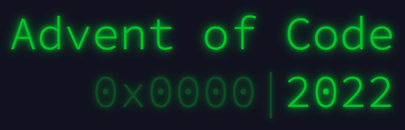

# Advent of Code 2022

Advent of Code is an Advent calendar of small programming puzzles for a variety of skill sets and skill levels that can be solved in any programming language you like. This repository contains solutions to the 2022 Advent of Code calendar.

Completed **2** out of **25** advent day puzzles.

Day | Problem | Languages
--- | --- | ---
1 | [See Puzzle](https://adventofcode.com/2022/day/1) |  
2 | [See Puzzle](https://adventofcode.com/2022/day/2) |  
